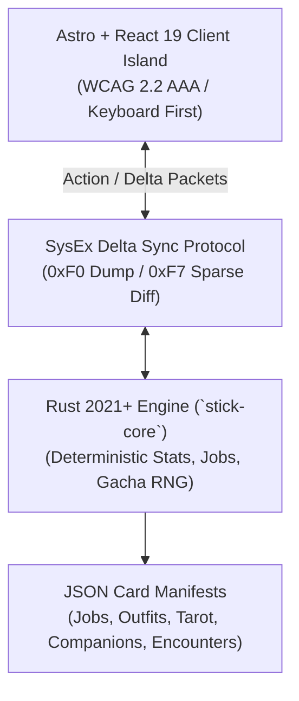

# Specification & Architecture Contract (`SPEC.md`)

> **StickHRPG: Degenerate Horizon (Cultured Consoomer Edition)**
> Specification Version: `v1.0.0-draft`
> Architectural Lineage: `zenOS` · `dev-master` · `atelier-2888` · `glitchworks-tarot`

---

## 1. High-Level Architecture Overview

StickHRPG marries classic Flash StickRPG life-simulation grind with modern gacha/otome/harem card collection, tarot divination modifiers, and deterministic SysEx-inspired delta streaming.

---

## 2. The Four-View Matrix (Glitchworks / Tarot Inheritance)

The application navigation is organized into four core game views, accessible via keyboard shortcuts `1`, `2`, `3`, and `4`:

| Key | View | Module ID | Core Purpose |
|:---:|:---|:---|:---|
| `1` | **Dex** | `hrpg-view-dex` | Wardrobe & Companion Archive. Inspect unlocked Outfits, Harem Companions, Tarot resonance, and lore cards. |
| `2` | **Arena** | `hrpg-view-arena` | Active Wage-Slaving & Hustles. Clock into career shifts, underground brawl pits, and bouncer gigs. |
| `3` | **Oracle** | `hrpg-view-oracle` | Gacha & Tarot Divination. Pull 10-card loot crates, manage pity counters, draw daily 3-card Tarot buff spreads. |
| `4` | **Forge** | `hrpg-view-forge` | Stat Training & Synthesizer. Gym workouts, bootcamps, outfit crafting, and companion resonance tuning. |

---

## 3. Data Contracts & State Entities

### 3.1 Player State (`PlayerState`)
- `id`: string (UUID)
- `name`: string
- `day`: number (1-indexed world day)
- `hour`: number (0-23, clock ticks advance 1-3 hours per activity)
- `energy`: number (0-100 max, sleeping resets to 100)
- `cash`: number (Liquid fiat currency)
- `crypto`: number (Volatile speculative currency)
- `stats`:
  - `str`: number (Strength & DPS)
  - `str_xp`: number
  - `int`: number (Intelligence & Tech skills)
  - `int_xp`: number
  - `chm`: number (Charm & Rizz)
  - `chm_xp`: number
  - `krm`: number (Karma: -100 to +100)
  - `dgn`: number (Degen Score: 0 to 10,000)
- `inventory`:
  - `outfit_ids`: string[]
  - `equipped_outfit_id`: string | null
  - `companion_ids`: string[]
  - `active_companion_id`: string | null
  - `active_tarot_buffs`: string[] (Active 3-card daily spread)
- `pity`:
  - `banner_pulls`: number
  - `guaranteed_featured`: boolean

---

## 4. Deterministic Formulas & XP Math

### 4.1 Stat XP Progression
$$\text{XP}_{\text{required}}(L) = \lfloor 100 \times L^{1.65} + 50 \times L \rfloor$$

### 4.2 Shift Wage Calculation
$$\text{ShiftPayout} = \text{BaseSalary} \times \left(1 + \frac{\text{PrimaryStat}}{100}\right) \times \text{OutfitMultiplier} \times \text{CompanionMultiplier} \times \text{TarotResonance}$$

### 4.3 Casino Multiplier Ladder (Edging Mechanic)
$$\text{Pot}(n) = \text{InitialBet} \times 2^n$$
*Bust probability increases per round $n$: $P(\text{bust}) = 0.15 + 0.08 \times n$. Busting inflicts -100% pot loss and "Existential Dread" (-20% INT for 1 game day).*
