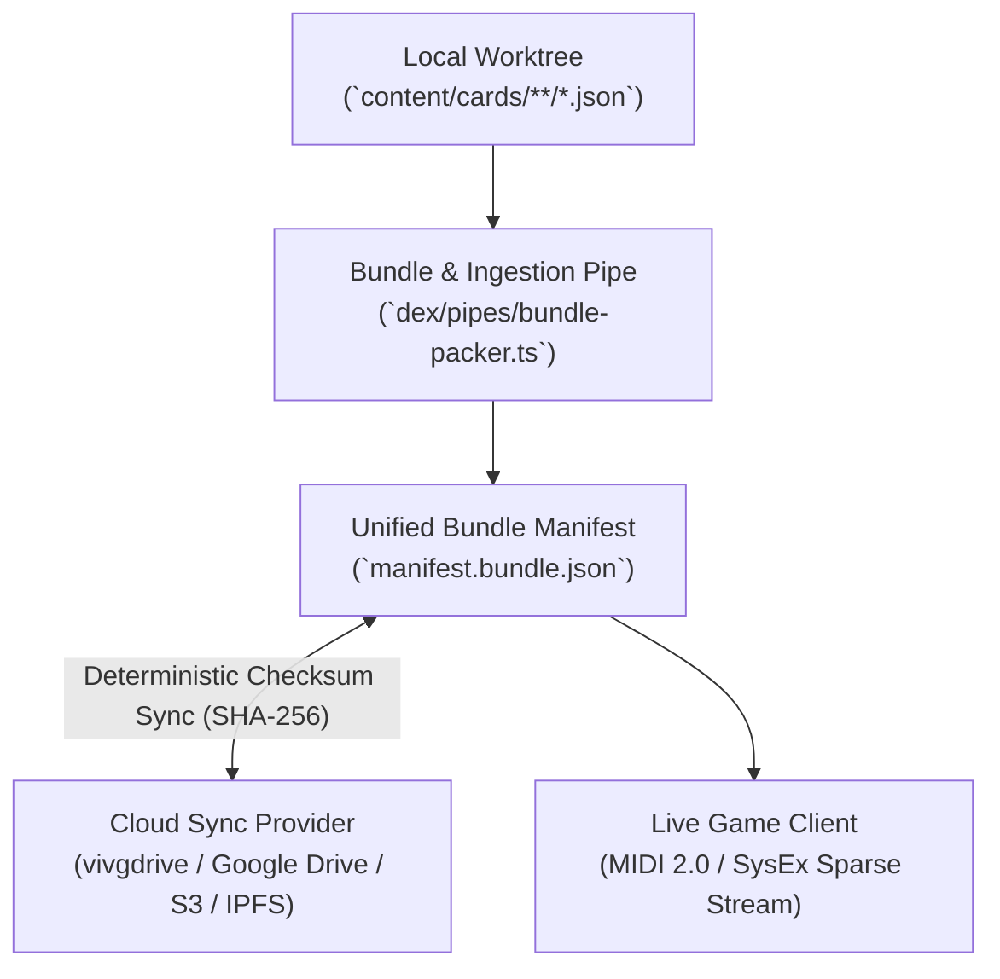

# Local & Cloud Sync Architecture: Card Manifest Bundles (`SYNC-ARCHITECTURE.md`)

> **Synchronization Protocol & Bundle Storage Matrix**  
> Architecture recommendation for local filesystem & cloud sync (vivgdrive / Google Drive / S3 / IPFS / Git worktree) of StickHRPG & Atelier JSON entity cards.

---

## 1. Overview & Sync Requirements

Game entity cards, lore manifests, save states, and scene definitions must operate reliably across two environments:
1. **Local Worktree / Native App**: Fast zero-allocation zero-copy file reads from disk (`content/cards/**/*.json`).
2. **Cloud Sync / Remote Storage (vivgdrive / Drive / Cloudflare R2 / S3)**: Periodic immutable bundle pushes, delta synchronizations, and collaborative community deck sharing.



---

## 2. Comparison of Cloud & Local Sync Options

| Provider / Strategy | Latency | Offline Support | Portability | Best Use Case |
|---|:---:|:---:|:---:|---|
| **Git LFS / Native Worktree** | Instant | ✅ Full | High | Developer authoring & version control |
| **vivgdrive / Google Drive Sync** | ~500ms | ✅ Cached | Very High | User save-states, custom decks, community mod packs |
| **Cloudflare R2 / S3 Object Store** | ~50ms | ❌ Network | Extreme | Global live game asset CDN & gacha banner distribution |
| **IPFS / Arweave Immutable Hashes** | Variable | ⚠️ Partial | Permanent | Verified gacha pull provenance & rare collector relics |

---

## 3. The Unified Bundle Manifest Schema (`manifest.bundle.json`)

To prevent partial sync corruptions, cards are compiled into a monolithic or chunked `manifest.bundle.json` container:

```json
{
  "bundle_version": "2026-08.1-mvp++",
  "bundle_id": "bundle_at_2869_core_v1",
  "timestamp": 1787067000,
  "checksum": "sha256:7f9a88b12c3d4e...",
  "card_counts": {
    "jobs": 3,
    "outfits": 3,
    "companions": 2,
    "tarot": 3,
    "scenes": 1,
    "actions": 1,
    "encounters": 2,
    "mechanics": 1
  },
  "index": [
    {
      "card_id": "scene:downtown_slums",
      "card_type": "scene",
      "path": "content/cards/templates/template_scene_card.json",
      "hash": "sha256:4f8a92b0c1e8d7a123f4b"
    },
    {
      "card_id": "action:prompt_sprint",
      "card_type": "action",
      "path": "content/cards/templates/template_action_card.json",
      "hash": "sha256:7c9e11a22f489b0981e"
    },
    {
      "card_id": "mechanic:core_engine_tuning",
      "card_type": "mechanic",
      "path": "content/cards/templates/template_mechanic_config.json",
      "hash": "sha256:99f81a0e8d7162bc5a"
    }
  ]
}
```

---

## 4. Conflict Resolution & Phase Alignment Strategy

1. **Deterministic Last-Write-Wins with Nonce**:
   - Every card mutation increments an integer `sync_nonce`.
   - Higher nonce wins; identical nonces fall back to lexically higher SHA-256 hash.
2. **Sparse SysEx Rehydration**:
   - On cloud reconnect (e.g. from mobile or browser island via vivgdrive), the client receives a lightweight `0xF0 SysExDump` containing only the bundle hash.
   - If the local hash matches, 0 bytes of asset data are transferred. If mismatch, only modified card diffs are streamed.
