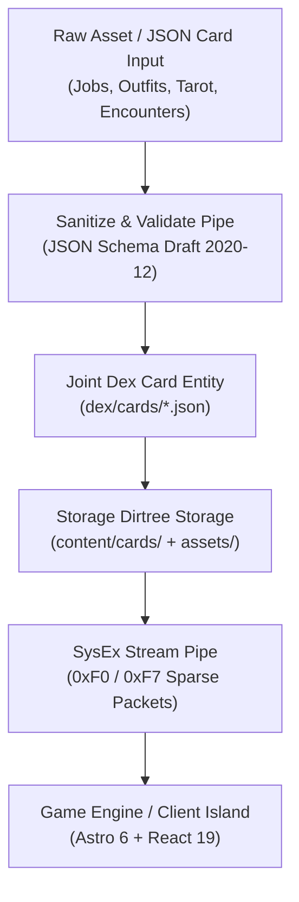

# Epic: AT-2869-STICKHRPG-001 — Atelier Asset Pipelines & Dirtree Hydration Architecture

**dex_id:** `0x7D:0x21`  
**parent:** `0x7D:0x20` (StickHRPG Core)  
**repository_target:** `at-2869-StickHRPG` (Private Atelier Seed Fork)  
**status:** `planning`  
**tags:** `atelier`, `asset-pipeline`, `dex-pipes`, `json-cards`, `dirtree`, `hydration`, `midi-2.0`, `stickhrpg`

---

## 1. High-Level Vision & Architecture

The **`at-2869-StickHRPG`** repo architecture integrates the game engine, json-card schema registry, and SysEx phase hydration into an **internal Dex asset pipe & storage dirtree pipeline**.



---

## 2. Atelier Storage Dirtree Layout (`at-2869-StickHRPG`)

```
at-2869-StickHRPG/
├── .cursor/                                 # Cursor agent quality gates & manifest rules
├── assets/                                  # Binary & Vector Game Assets
│   ├── sprites/                             # Stickman vector SVGs, outfit layer overlays
│   ├── audio/                               # Sound effects & synthesized 8-bit retro chiptunes
│   └── shaders/                             # CRT glitch & holographic card WebGL shaders
├── dex/                                     # Internal Dex Registry & Pipe Metadata
│   ├── cards/                               # Indexable Dex Card Entities
│   │   ├── index.json                       # Catalog index of all registered Dex pipe assets
│   │   ├── DEX-ASSET-JOBS.json              # Asset pipe card for Job ladder cards
│   │   ├── DEX-ASSET-OUTFITS.json           # Asset pipe card for Outfits & cosmetic multipliers
│   │   ├── DEX-ASSET-TAROT.json             # Asset pipe card for Tarot divination spread
│   │   ├── DEX-ASSET-COMPANIONS.json        # Asset pipe card for Otome harem companions
│   │   └── DEX-ASSET-ENCOUNTERS.json        # Asset pipe card for Visual novel branching trees
│   └── pipes/                               # Reusable Transformation & Ingestion Pipes
│       ├── validate-card.ts                 # Validates card against schemas/*.schema.json
│       ├── hydrate-manifest.ts              # Ingests JSON files into typed GameState registry
│       └── sysex-pack.ts                    # Serializes delta packets to MIDI 2.0 bitmask bytes
├── content/cards/                           # Canonical JSON Card Entity Manifests
│   ├── jobs/                                # fast_food_flipper.json, prompt_engineer.json, shadow_ceo.json
│   ├── outfits/                             # maid_tuxedo.json, cyber_bunny.json, tracksuit.json
│   ├── companions/                          # tech_lead_senpai.json, yandere_crypto_bro.json
│   ├── tarot/                               # the_fool_000.json, the_magician_001.json, high_priestess_002.json
│   ├── encounters/                          # awkward_watercooler.json, back_alley_deal.json
│   └── banners/                             # launch_consoomer_fever.json
├── schemas/                                 # JSON Schema Manifests (Draft 2020-12)
│   ├── player_state.schema.json
│   ├── job_card.schema.json
│   ├── outfit_card.schema.json
│   ├── companion_card.schema.json
│   ├── tarot_card.schema.json
│   ├── encounter_card.schema.json
│   ├── gacha_banner.schema.json
│   └── sysex_delta_packet.schema.json
├── packages/
│   └── stick-core/                          # Rust 2021+ Deterministic Core Engine (Cargo Workspace)
│       ├── Cargo.toml
│       └── src/
│           ├── lib.rs
│           ├── stats.rs                     # XP math, fatigue costs, 24h world clock
│           ├── jobs.rs                      # Promotion eligibility & wage calculations
│           ├── gacha.rs                     # Deterministic pity curves (0.015 base -> 1.0 @ 90)
│           ├── tarot.rs                     # Elemental resonance & daily 3-card spread modifiers
│           ├── sync.rs                      # 32-bit bitmask delta diff calculation & hydration
│           └── player.rs                    # Core player state container
├── src/
│   ├── components/
│   │   ├── GameShell.tsx                    # Main UI shell (HUD, 4-View Router, Keyboard Nav)
│   │   ├── StatBar.tsx                      # Dynamic real-time HUD (Cash, Energy, STR, INT, CHM, DGN)
│   │   ├── views/
│   │   │   ├── DexView.tsx                  # Wardrobe, Companions & Dex Asset Library
│   │   │   ├── ArenaView.tsx                # Career shifts, fight pits, wage-slaving
│   │   │   ├── OracleView.tsx               # Gacha crate pulls & Daily tarot divination
│   │   │   └── ForgeView.tsx                # Gym grinds, study sessions, outfit crafting
│   │   └── CasinoMiniGame.tsx               # Multiplier ladder ($2^n$) & edging risk/reward
│   ├── lib/
│   │   ├── entities/                        # Typed Joint Entities & Interfaces
│   │   ├── pipes/                           # Client-side Asset & State Hydration Pipes
│   │   └── game/                            # Core TypeScript engine bindings & tests
│   ├── pages/
│   │   ├── index.astro                      # Cockpit Triage Dashboard
│   │   └── game.astro                       # StickHRPG Game Viewport
│   └── styles/
│       └── global.css                       # zenOS glassmorphic palette, CRT glow tokens
├── docs/
│   ├── reflibs.md                           # Tech Stack Reference & Canonical Docs URLs
│   ├── whitepaper_stick_rpg.md             # Product Vision & Game Design Whitepaper
│   ├── SPEC.md                              # Dex/Arena/Oracle/Forge View Spec
│   ├── TESTING.md                           # Testing Methodology & Quality Gates
│   ├── TESTIDS.md                           # Canonical data-testid Registry
│   ├── tasks-backlog.json                   # Structured JSON Task Backlog
│   └── mechanics/                           # Per-Mechanic Planning Specs
├── dex-entry.md                             # Dex entry manifest (0x7D:0x20)
└── tasks.md                                 # Implementation Tasks & Epic Backlog
```

---

## 3. Dex Asset Pipe Specification

### 3.1 Ingestion & Sanitization Pipe (`dex/pipes/validate-card.ts`)
- Every card in `content/cards/**` is ingested through JSON Schema validation.
- Schema violations immediately fail in CI (`npm run test`) and output formatted validation errors.

### 3.2 Dex Asset Transformation Pipe (`dex/pipes/hydrate-manifest.ts`)
- Transmutes static card manifests into typed `DexAssetCard` entities.
- Appends metadata tags, elemental resonance bindings, and SysEx field keys.

### 3.3 SysEx Delta Sync Pipe (`dex/pipes/sysex-pack.ts`)
- Streams sparse state mutations into bitmask packets (`0xF7`), enabling low-latency hydration on Astro client islands.
