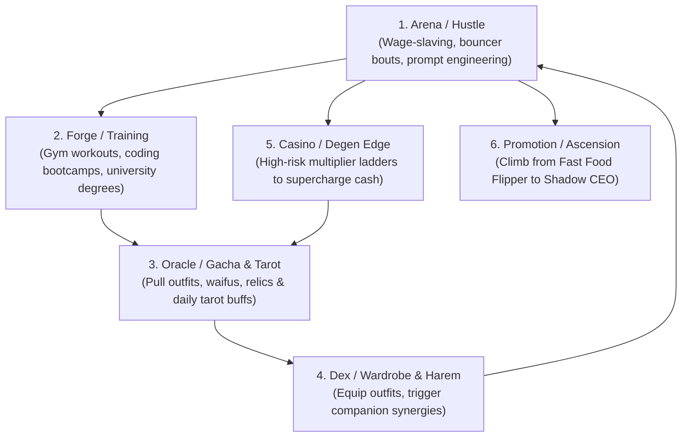

# StickHRPG: Degenerate Horizon (Cultured Consoomer Edition) — Product Vision & Whitepaper

> **Document Version:** `1.0.0-draft`  
> **Target Stack:** Rust 2021+ Deterministic Core (`stick-core`), Astro 6+, React 19 Client Islands, JSON Card Manifests, SysEx Delta Synchronization, Vitest, WCAG 2.2 AAA.

---

## 1. Executive Summary & Product Vision

### 1.1 The High Concept
**"StickHRPG: Degenerate Horizon"** is a satirical, hyper-addictive browser RPG combining the classic, unhinged daily life grind of Flash-era **StickRPG** (top-down isometric navigation, dead-end corporate wage-slaving, gym stat maxing, casino gambling, back-alley trades) with the high-dopamine meta-progression of modern **gacha / otome / harem games** and **cyber-mystic tarot divination**.

### 1.2 Target Audience & Satirical Themes
- **The Cultured Consoomer**: High self-awareness, meme-fluent, appreciative of spicy/dark humor, cynical takes on late-stage capitalism, tech-bro hustle culture, gacha mechanics, and degenerate crypto speculation.
- **Neurodivergent-Friendly Design**: High-contrast, clean visual hierarchy, keyboard-first navigation (`WASD`, `1-4`, `Space`, `Enter`, `R`), adjustable animation speeds, zero motion-sickness triggers, and instant gratification loops.

---

## 2. Core Game Loop & Gameplay Pillars



### 2.1 The Daily Time & Energy Cycle
- **World Clock**: 24-hour day/night cycle. Activities advance the clock by 1 to 4 hours.
- **Energy Pool**: 100/100 Energy per day.
  - Working shifts consume 20-35 Energy.
  - Stat workouts consume 15-25 Energy.
  - Casino & Gacha consume minimal Energy (5-10) but scale with Degen score.
- **Sleep & Nightly Settlement (`hrpg-btn-sleep` / `R`)**:
  - Restoring Energy to 100.
  - Applying daily bank interest vs. apartment rent deductions.
  - Cycling the daily 3-card Tarot divination spread in Oracle.

---

## 3. Detailed Game Mechanics

### 3.1 Stat System & XP Scaling
1. **`Strength` (STR)**: Physical power, intimidation, bouncer gigs, fight club DPS.
2. **`Intelligence` (INT)**: Hacking efficiency, day-trading yields, prompt engineering promotions.
3. **`Charm` (CHM)**: Visual novel romance success, corporate rizz, discount negotiation.
4. **`Karma` (KRM)**: Alignment from -100 (Crime Syndicate Overlord) to +100 (Patron Saint). Gates specific storylines, jobs, and companion romance paths.
5. **`Degen Score` (DGN)**: 0 to 10,000. Earned from gambling, gacha pulls, and sketchy black-market deals. High Degen unlocks "Fever Mode" and underground venues.

**XP Formula:**
$$\text{XP}_{\text{required}}(L) = \lfloor 100 \times L^{1.65} + 50 \times L \rfloor$$

### 3.2 Career Ladders & Promotions (Arena Module)
- **Fast Food Track**: Fry Cook $\rightarrow$ Shift Supervisor $\rightarrow$ Regional Fry Tyrant.
- **Tech / Prompting Track**: Junior Prompt Monkey $\rightarrow$ AI Wrangler $\rightarrow$ 10x Lead Architect.
- **Finance Track**: Penny Stock Gambler $\rightarrow$ Rogue Option Trader $\rightarrow$ Hedge Fund Predator.
- **Syndicate Track**: Street Lookout $\rightarrow$ Loan Shark Enforcer $\rightarrow$ Shadow Underboss.

**Promotion Check:**
$$\text{PromoteReady} = (\text{STR} \ge \text{Req}_{\text{STR}}) \land (\text{INT} \ge \text{Req}_{\text{INT}}) \land (\text{CHM} \ge \text{Req}_{\text{CHM}}) \land (\text{Rep} \ge \text{Req}_{\text{Rep}})$$

**Shift Payout Formula:**
$$\text{Payout} = \text{BaseSalary} \times \left(1 + \frac{\text{PrimaryStat}}{100}\right) \times \text{OutfitMultiplier} \times \text{CompanionMultiplier} \times \text{TarotResonance}$$

### 3.3 The Cultured Consoomer Gacha System (Oracle Module)
- **Banner Crates**: "Cosplay Maid Extravaganza", "Cyberpunk Bunny Rig", "CEO Domination Suit".
- **Rarity Tiers**: Common (R, 70%), Rare (SR, 28.5%), Ultra Rare (SSR, 1.5%).
- **Pity Engine**:
  - Soft Pity starts at pull 70 (+5% per pull).
  - Hard Pity guaranteed SSR at pull 90.
  - 50/50 Banner Guarantee (if first SSR is off-banner, next SSR is guaranteed on-banner).

### 3.4 Tarot Synergy & Divination (Inherited from `glitchworks-tarot`)
- Daily 3-card Tarot Spread drawn at sunrise:
  - **The Magician (Fire)**: `+50% INT gain, -10% Energy cost on Prompting shifts`.
  - **The Fool (Void)**: `+100% Degen gain, 2x Casino payout ceiling, -10% INT`.
  - **High Priestess (Water)**: `+30% Charm, 2x Otome affinity gain`.
  - **The Emperor (Aether)**: `+40% Base Salary on Corporate Shifts`.

### 3.5 The Casino & "Edging" Mini-Game
- Player bets base cash on consecutive binary predictions (High/Low, Red/Black, Crypto Pump/Dump).
- Each consecutive win doubles the current pot ($2^n$) and charges the **Dopamine Meter**.
- Player can **Cash Out** at any stage.
- If player busts, 100% of the pot is liquidated and they suffer the **"Existential Dread"** debuff (-20% INT for 1 game day).

---

## 4. SysEx-Inspired State Streaming Protocol

To ensure minimal wire latency, zero jitter, and deterministic state sync:
1. **`0xF0 SysExDump` Handshake**: Transmits full schema checksum, player inventory array, base stats, world clock, and event flags.
2. **`0xF7 SysExDelta` Stream**: A compact 32-bit bitmask indicating which fields mutated in the tick/action, followed solely by the mutated values.

```
+---------------+------------------------+------------------------------------+
| 0xF0 Header   | 32-bit Field Bitmask   | Variable Payload (Mutated Fields)  |
+---------------+------------------------+------------------------------------+
```
- Bit 0: Cash (`u64`)
- Bit 1: Crypto (`u64`)
- Bit 2: Energy (`u8`)
- Bit 3: STR XP (`u32`)
- Bit 4: INT XP (`u32`)
- Bit 5: CHM XP (`u32`)
- Bit 6: DGN Score (`u32`)
- Bit 7: World Hour (`u8`)
- Bit 8: Active Tarot Buff IDs (`Vec<String>`)
